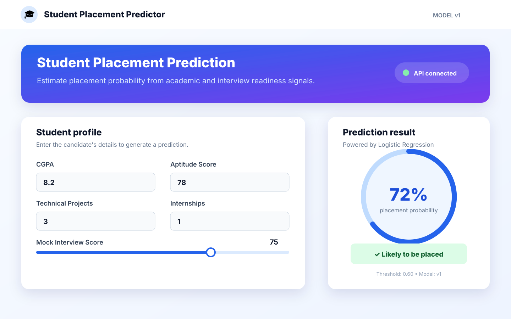
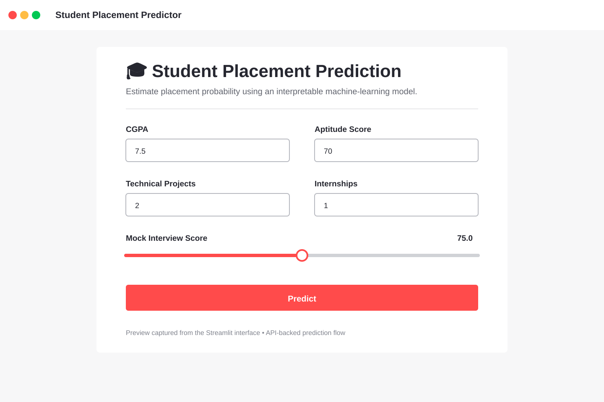

# 🎓 Student Placement Prediction

<p align="center">
  <strong>A polished, end-to-end machine-learning experience for estimating student placement probability.</strong><br />
  <sub>Train a model · serve predictions with FastAPI · explore them in Streamlit</sub>
</p>

<p align="center">
  <a href="https://github.com/sgsinghashka-del/Student_Placement-_Prediction-_Logistic_-Regression"></a>
  <a href="https://fastapi.tiangolo.com/"></a>
  <a href="https://streamlit.io/"></a>
  <a href="https://scikit-learn.org/stable/modules/linear_model.html#logistic-regression"></a>
  <a href="https://www.docker.com/"></a>
</p>

<p align="center">
  
</p>

## Why this project?

Placement-readiness signals are easier to act on when they are available through a simple, explainable workflow. This project turns five student attributes into a probability estimate and exposes the model through both an API and a lightweight web interface.

> **Important:** the training data is synthetic and the application is for demonstration and learning. It must not be used to make real hiring or educational decisions.

## Product snapshot

| Capability | What it provides |
| --- | --- |
| **Prediction** | Probability of placement plus a thresholded classification |
| **Explainability** | Logistic Regression coefficients for feature-level interpretation |
| **Observability** | Request count, average latency, model version, and API logs |
| **Repeatability** | Seeded synthetic data and a versioned `model_v1.pkl` artifact |
| **Deployment** | Separate API/UI Docker images orchestrated with Compose |

## Streamlit experience

The interface mirrors the actual controls in `app.py`: CGPA, aptitude score, technical projects, internships, and mock interview score. After submission, it displays a probability, placement recommendation, and model version.

<p align="center">
  
</p>

> The repository contains a generated, screenshot-style SVG preview because the application is run locally. Launch the app with the instructions below to view the live Streamlit output.

## Architecture

```text
┌──────────────────────┐       HTTP        ┌────────────────────────┐
│ Streamlit UI :8501  │ ────────────────▶ │ FastAPI API :8000      │
│ student inputs       │                  │ /predict /explain       │
└──────────────────────┘                  │ /metrics /             │
                                          └───────────┬────────────┘
                                                      │
                                          ┌───────────▼────────────┐
                                          │ StandardScaler +       │
                                          │ LogisticRegression      │
                                          └───────────┬────────────┘
                                                      │
                                          model/model_v1.pkl + logs
```

## Inputs

| Field | Meaning | Range / example |
| --- | --- | --- |
| `CGPA` | Academic performance | `5.0–10.0` |
| `Aptitude_Score` | Logical and aptitude assessment | `40–100` |
| `Technical_Projects` | Completed technical projects | `0+` |
| `Internships` | Completed internships | `0+` |
| `Mock_Interview_Score` | Interview-readiness score | `50.0–100.0` |

## Run locally

```bash
git clone https://github.com/sgsinghashka-del/Student_Placement-_Prediction-_Logistic_-Regression.git
cd Student_Placement-_Prediction-_Logistic_-Regression
python -m venv .venv
source .venv/bin/activate                 # Windows: .venv\Scripts\activate
python -m pip install --upgrade pip
pip install -r requirements.txt
python train_model.py
```

Start the API in one terminal:

```bash
uvicorn main:app --reload
```

Start Streamlit in another:

```bash
streamlit run app.py
```

Open `http://localhost:8501` for the UI or `http://localhost:8000/docs` for interactive API documentation.

## Run with Docker

The Compose setup builds two small services and connects the UI to the API by service name:

```bash
docker compose up --build
```

Then open:

- **Streamlit UI:** `http://localhost:8501`
- **FastAPI docs:** `http://localhost:8000/docs`
- **API health:** `http://localhost:8000/`

Stop the stack with `docker compose down`. API logs are retained in the named `api_logs` volume during the Docker environment's lifetime.

To change the decision threshold:

```bash
PREDICTION_THRESHOLD=0.7 docker compose up --build
```

## API quick reference

### `GET /`

```json
{"status":"running","model_version":"v1","threshold":0.6}
```

### `POST /predict`

```bash
curl -X POST http://localhost:8000/predict \
  -H 'Content-Type: application/json' \
  -d '{"CGPA":8.2,"Aptitude_Score":78,"Technical_Projects":3,"Internships":1,"Mock_Interview_Score":75}'
```

### `POST /explain`

Returns the model's standardized Logistic Regression coefficients for the five input features.

### `GET /metrics`

Returns in-process request count, average latency, and active model version.

## Repository map

```text
.
├── app.py                 # Streamlit frontend
├── main.py                # FastAPI inference service
├── train_model.py         # Synthetic data generation and training
├── requirements.txt       # Python dependencies
├── Dockerfile.api         # API image
├── Dockerfile.ui          # Streamlit image
├── docker-compose.yml     # Two-service local deployment
├── docs/
│   ├── project-preview.svg
│   └── streamlit-screenshot.svg
└── README.md
```

## Roadmap

- Add automated tests and CI.
- Report precision, recall, ROC-AUC, and calibration metrics.
- Replace synthetic data with validated, privacy-preserving data.
- Add model/data versioning and drift monitoring.
- Add authentication and persistent observability.

